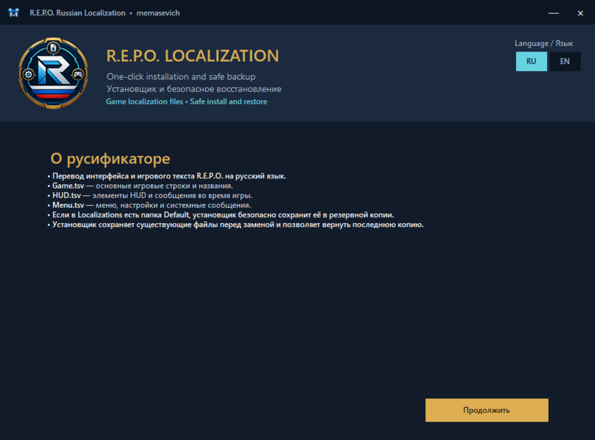
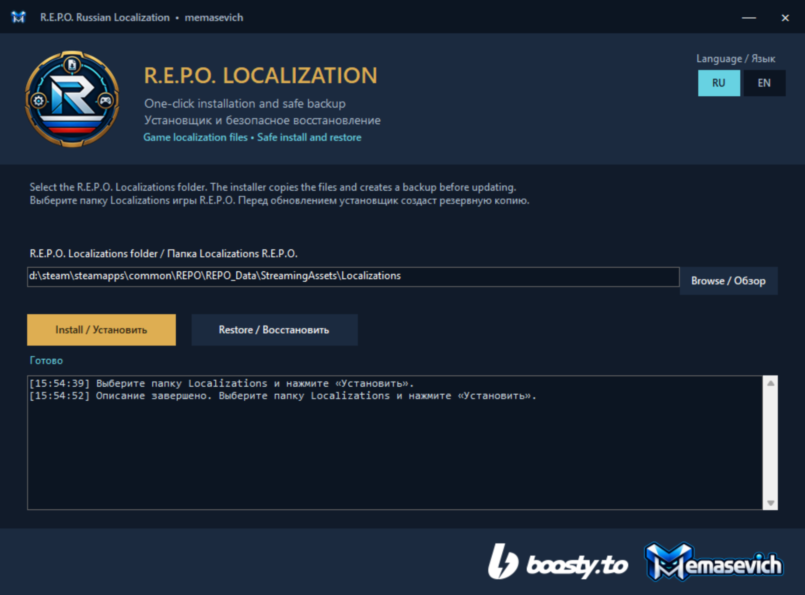

# R.E.P.O. Русификатор (100%) by memasevich

Полная качественная локализация игры **R.E.P.O.** (Semiwork).
Переведено ~100% игрового контента: предметы, монстры, обучение, меню, HUD и настройки.

## 📥 Установка через установщик

Скачайте готовый установщик из раздела [Releases](https://github.com/memasevich/repo-russianlocalization/releases):

[**Скачать RepoRussianLocalizationInstaller.exe**](https://github.com/memasevich/repo-russianlocalization/releases/latest/download/RepoRussianLocalizationInstaller.exe)

Перед установкой полностью закройте игру **R.E.P.O.** и Steam-окно просмотра файлов игры.

### Шаг 1. Запустите установщик

Запустите `RepoRussianLocalizationInstaller.exe`. На заставке появится логотип memasevich, затем откроется окно установки.



### Шаг 2. Проверьте путь

Установщик автоматически ищет Steam-библиотеки через стандартные папки Steam, реестр, `libraryfolders.vdf` и доступные диски.

Для обычной установки путь выглядит так:

```text
C:\Program Files (x86)\Steam\steamapps\common\R.E.P.O.\REPO_Data\StreamingAssets\Localizations
```

У тебя, например, используется другая библиотека Steam:

```text
D:\steam\steamapps\common\REPO\REPO_Data\StreamingAssets\Localizations
```

Новая версия установщика умеет находить такой путь автоматически. Если путь всё же не определился, нажмите **Browse / Обзор** и выберите именно папку `Localizations`.

Проверьте, что выбранная папка заканчивается на:

```text
REPO_Data\StreamingAssets\Localizations
```

Не выбирайте:

```text
REPO_Data
StreamingAssets
Localizations\Default
```



### Шаг 3. Нажмите «Install / Установить»

Установщик положит файлы напрямую в корень `Localizations`:

```text
Localizations\Game.tsv
Localizations\HUD.tsv
Localizations\Menu.tsv
```

Файлы не попадут во вложенную папку `Default`.

### Что происходит с папкой `Default`

Если в `Localizations` существует папка `Default`, установщик не удаляет её безвозвратно. Перед установкой она переносится в резервную копию рядом с папкой игры:

```text
Localizations.backup-YYYYMMDD-HHMMSS-xxxxxx\Default
```

Это нужно для совместимости с конфигурациями, где игра продолжает использовать стандартные файлы из `Default`. После установки в рабочем `Localizations` остаются файлы перевода непосредственно в корне.

### Шаг 4. Перезапустите игру

После успешной установки закройте установщик и запустите **R.E.P.O.** заново. Игра должна перечитать файлы локализации.

## ♻️ Восстановление оригинальных файлов

Если потребуется вернуть предыдущую версию:

1. Запустите установщик снова.
2. Проверьте тот же путь `REPO_Data\StreamingAssets\Localizations`.
3. Нажмите **Restore / Восстановить**.

Установщик восстановит старые `Game.tsv`, `HUD.tsv`, `Menu.tsv` и папку `Default`, если она была до установки. Текущие файлы перед восстановлением будут сохранены в папку `Localizations.before-restore-*`.

## 🛠 Ручная установка без EXE

Если вы не хотите использовать установщик:

1. Откройте папку игры через Steam: **Библиотека → R.E.P.O. → Управление → Просмотреть локальные файлы**.
2. Перейдите в `REPO_Data\StreamingAssets\Localizations`.
3. Если у вас возникает проблема с загрузкой перевода, закройте игру и перенесите папку `Default` в безопасное место как резервную копию.
4. Скопируйте `Game.tsv`, `HUD.tsv` и `Menu.tsv` прямо в корень `Localizations`.
5. Запустите игру заново.

Важно: файлы должны лежать непосредственно в `Localizations`, а не в `Localizations\Default`.

## ✨ Особенности перевода

- **Безопасная установка:** перед заменой создаётся резервная копия файлов и папки `Default`.
- **Автопоиск Steam:** поддерживаются стандартные и дополнительные Steam-библиотеки, включая отдельные диски.
- **Совместимость путей:** поддерживаются каталоги игры `R.E.P.O.` и `REPO`.
- **Безопасное восстановление:** предыдущую версию можно вернуть кнопкой `Restore / Восстановить`.
- **Качественные шрифты:** полная поддержка кириллицы в оригинальном стиле текста.
- **Атмосфера:** термины адаптированы с сохранением фирменного стиля игры.

## 🐛 Если перевод не появился

Проверьте по порядку:

1. Игра была полностью закрыта во время установки.
2. Путь заканчивается на `REPO_Data\StreamingAssets\Localizations`.
3. `Game.tsv`, `HUD.tsv` и `Menu.tsv` лежат прямо в `Localizations`.
4. Внутри `Localizations\Default` не осталась единственная копия файлов перевода.
5. Игра была перезапущена после установки.

Если проблема остаётся, приложите к Issue скриншот выбранного пути и содержимое окна журнала установщика. Не прикладывайте к Issue личные данные и полный список файлов с других дисков.

## 📦 Содержимое релиза

В каждом релизе доступны:

- `RepoRussianLocalizationInstaller.exe` — автономный установщик для Windows;
- исходный код установщика и payload в архиве исходников GitHub;
- инструкция по автоматической и ручной установке в этом README.

## 🐛 Обратная связь

Если вы нашли опечатку, ошибку перевода или проблему установки, пожалуйста, создайте [Issue](https://github.com/memasevich/repo-russianlocalization/issues) в этом репозитории.
